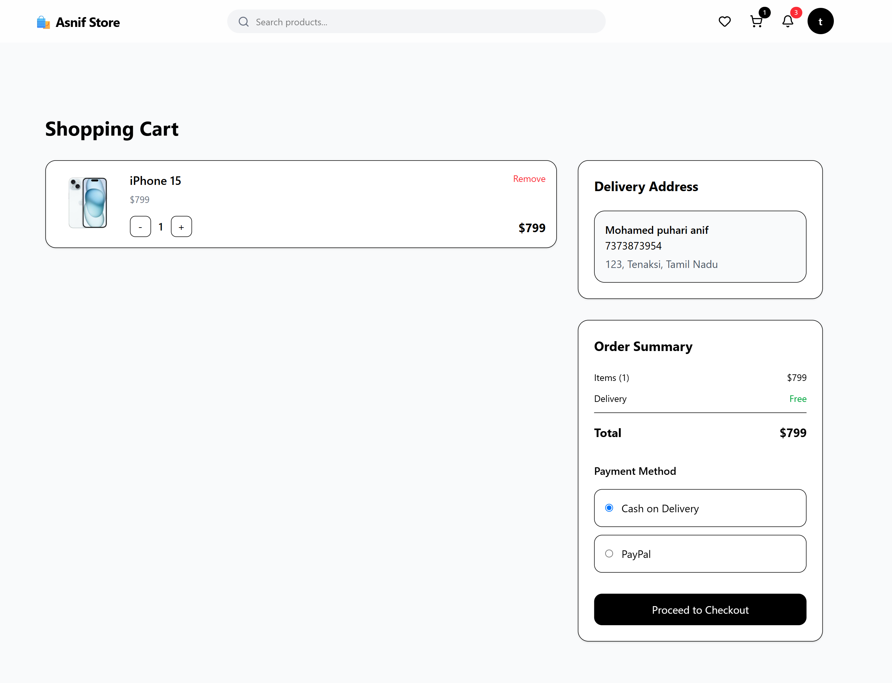
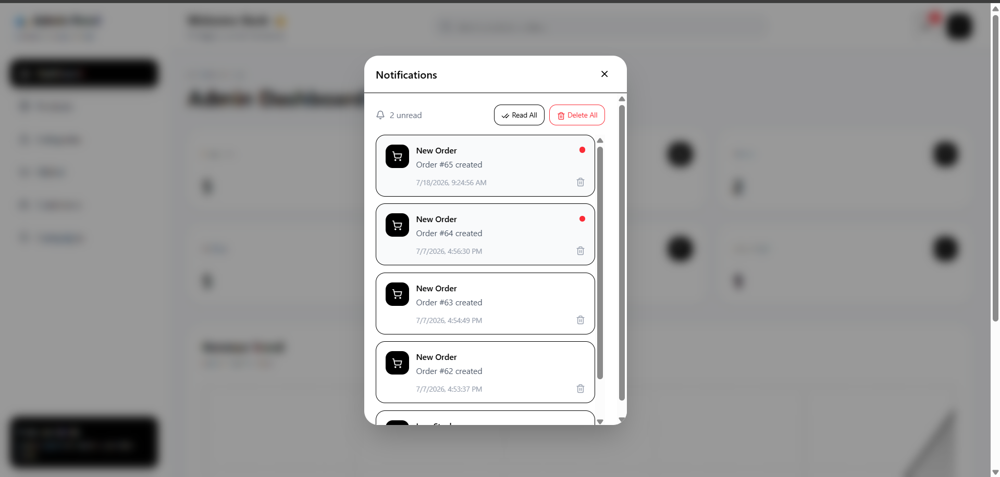

# 🛒 Full Stack E-Commerce Platform

A modern full-stack e-commerce platform built with React.js, Node.js, Express.js, PostgreSQL, and Prisma ORM.

The application provides a complete shopping experience with product management, cart, checkout, PayPal payments, real-time notifications, inventory management, and admin dashboard functionality.

---

## 🚀 Features

### User Features

* User Registration & Login
* JWT Authentication
* Product Browsing & Search
* Category Filtering
* Shopping Cart
* Wishlist Management
* Checkout & Order Placement
* PayPal Payment Integration
* Order Tracking
* Real-Time Order Status Updates
* Browser Notifications

### Admin Features

* Dashboard Analytics
* Product Management
* Category Management
* Inventory Management
* Order Management
* User Management
* Low Stock Alerts
* Real-Time Order Notifications
* Notification Center

### Real-Time Features

* Socket.IO Integration
* Instant Admin Notifications
* Live Order Updates
* User Order Status Notifications
* Real-Time Inventory Alerts

---

## 🛠 Tech Stack

### Frontend

* React.js
* TypeScript
* Tailwind CSS
* TanStack Query
* Zustand
* React Hook Form
* Socket.IO Client

### Backend

* Node.js
* Express.js
* Prisma ORM
* PostgreSQL
* JWT Authentication
* Zod Validation
* Socket.IO

### Payments

* PayPal Checkout Integration

## 🚧 Project Status

This project is currently under active development and runs locally.

Features implemented:
- JWT Authentication
- PayPal Integration
- Admin Dashboard
- Real-Time Notifications
- Live Order Updates
- Product & Order Management

---

## 📸 Screenshots

### Home Page


### Product Listing


### Product Details


### Cart



### Checkout


### Admin Dashboard


### Orders Management


### Notifications



---

## 📂 Project Structure

frontend/
├── src/
├── components/
├── pages/
├── hooks/
└── store/

backend/
├── controllers/
├── routes/
├── prisma/
├── middleware/
├── socket/
└── utils/

---

## ⚙️ Installation

### Frontend

```bash
npm install
npm run dev
```

### Backend

```bash
npm install
npm run dev
```

### Prisma

```bash
npx prisma migrate dev
npx prisma generate
```

---

## 🔥 Key Highlights

* Full-Stack Architecture
* PayPal Payment Gateway
* Real-Time Notifications
* Live Order Tracking
* Inventory Management
* Admin Dashboard
* Responsive Design
* REST API Architecture
* PostgreSQL Database
* Socket.IO Integration

---

## 👨‍💻 Author

Mohamed Puhari Anif Y

LinkedIn:
https://www.linkedin.com/in/mohamed-puhari-anif-y-787801254/

GitHub:
https://github.com/Anif23

Portfolio:
https://anif-portfolio-app.vercel.app/
