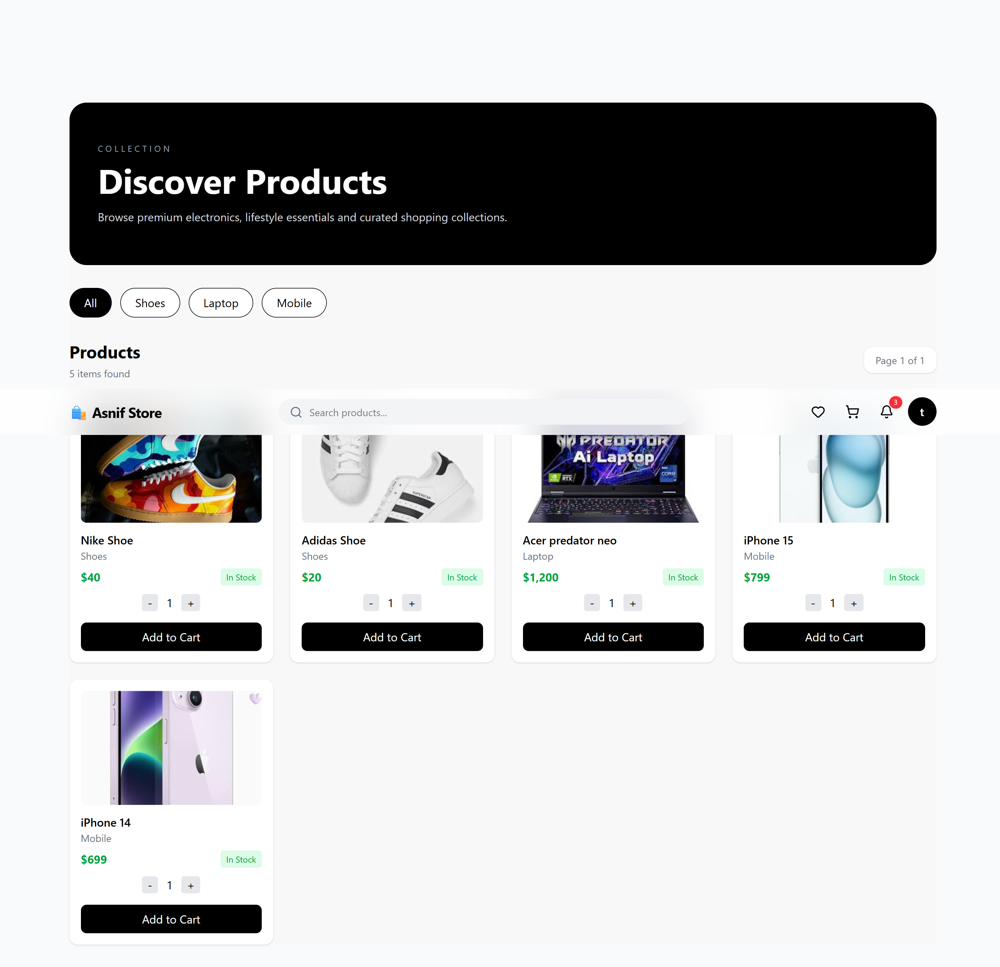
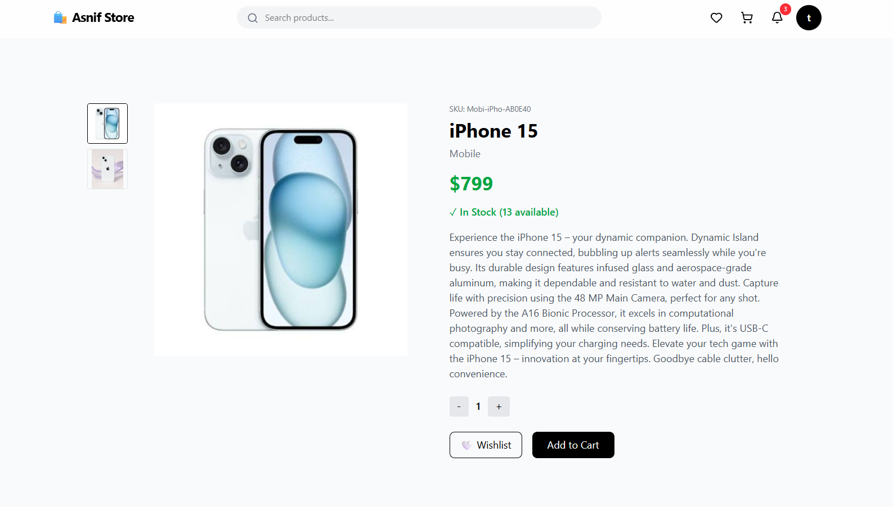
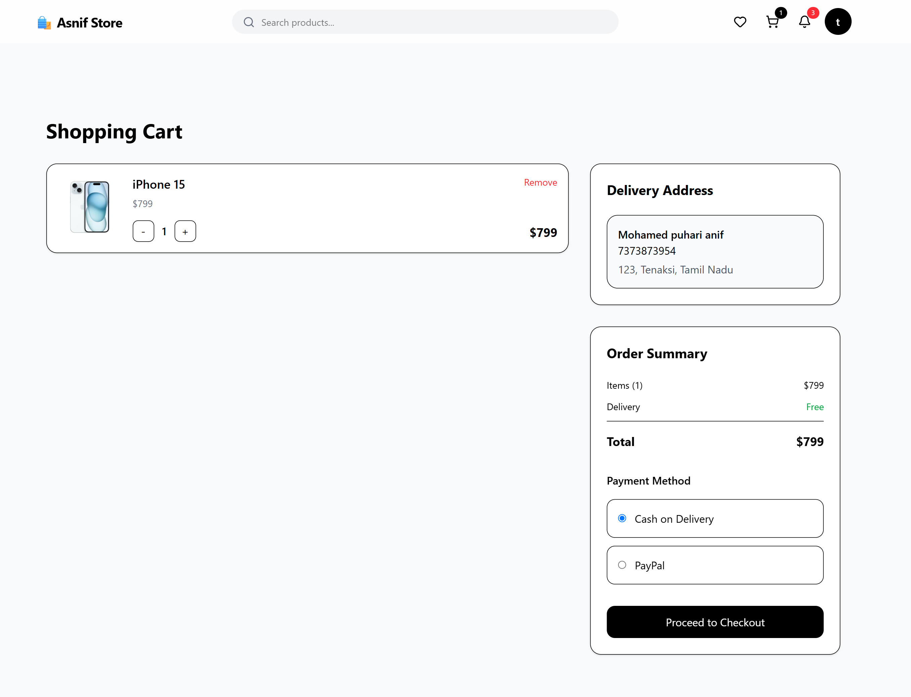
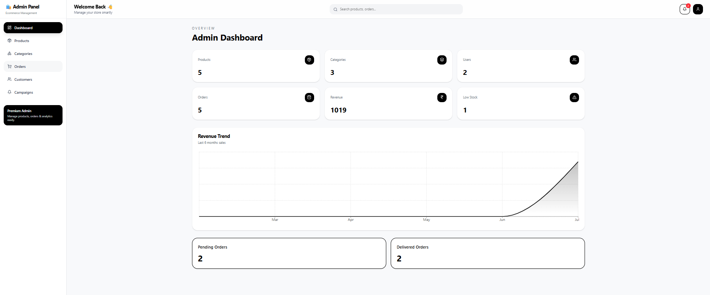
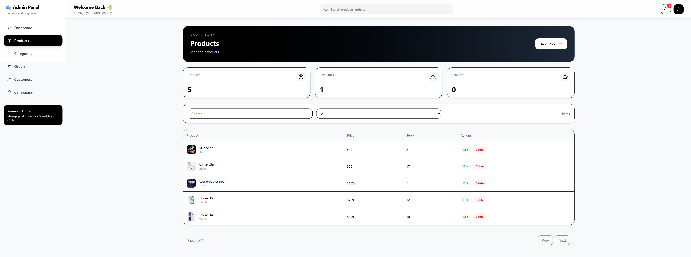

# 🛍️ Asnif Store — Full-Stack E-Commerce Platform

A modern, production-ready online store built with **React + TypeScript**, **Node/Express**, **PostgreSQL** and **Prisma**.

Asnif Store is an **India-focused storefront**: every price is in **Indian rupees (₹ / INR)**, tax is **GST**
(default 18%), shipping is **₹49** and **free above ₹999**, addresses are Indian (state + 6-digit PIN code) and
payments support **Cash on Delivery**, **PayPal**, **Stripe** and a **mock simulator** for local development.

It ships with a complete shopping journey — browse/search/filter, product variants, wishlist, cart, coupons,
checkout, live order tracking, reviews and support tickets — plus an admin console for products, inventory,
orders, customers, promotions, reports and support.

---

## ✨ Features

### Shopper

| Area | What you get |
| --- | --- |
| Catalog | Search with debounce, category/brand/price/rating facets, sorting, pagination, featured deals |
| Product page | Variant matrix (size/colour…) with per-variant price, stock and SKU, gallery, discount badge, stock warnings, reviews with rating distribution |
| Wishlist | Guest wishlist that merges into the account on sign-in |
| Cart | Variant-aware lines, quantity stepper, stock validation before checkout, coupon codes, free-shipping nudge |
| Checkout | Saved address book or one-off address, customer note, method picker (COD / PayPal / Stripe / mock), live totals with GST and shipping |
| Orders | Order history, filters, detail page with GST invoice-style totals, **order tracking timeline** (Placed → Paid → Processing → Shipped → Delivered), cancellation |
| Reviews | Write/edit a review only after purchase, helpful flags, admin moderation |
| Support | Raise tickets against an order, threaded replies, FAQ |
| Account | Profile, addresses, notifications (real-time), reviews |
| Legal | Privacy Policy, Refund & Returns, Shipping & Delivery, Terms & Conditions, Cookie Policy + **cookie consent banner** |

### Admin console

Dashboard KPIs and revenue chart · product CRUD with **variants, options, images and stock logs** ·
categories · inventory report (valuation, low stock, out of stock) · order management with the full status
machine and tracking numbers · customers · coupons and announcements · review moderation · support inbox ·
30/90-day reports (revenue, top products, categories, customers).

### Platform & engineering

- Feature-based modules on the API (`auth`, `catalog`, `cart`, `checkout`, `payments`, `orders`, `reviews`,
  `account`, `wishlist`, `support`, `promotions`, `admin`) behind one typed Axios layer on the web.
- Reusable UI kit (`components/ui`), shared storefront/common components, typed hooks for every query.
- Real-time notifications and admin alerts over Socket.IO.
- Loading skeletons, empty states, error boundaries and error states on every data screen.
- Route-level code splitting (the admin console and charts are lazy chunks), Tailwind v4 design tokens,
  reduced-motion support and GPU-friendly animations (transform/opacity only).
- 49 backend tests (pricing, catalog, guards, full purchase journey) and two runnable frontend checks
  (API journey + SSR render smoke).

---

## 🧱 Tech stack

**Frontend** — React 19, TypeScript (strict), Vite, Tailwind CSS v4, TanStack Query, React Router,
Axios, React Hot Toast, Recharts (lazy), lucide-react, Socket.IO client, Stripe.js + PayPal SDK (optional).

**Backend** — Node 22, Express 5, Prisma 6 (PostgreSQL, `pg` driver adapter), Zod validation, JWT access +
rotating refresh cookies, bcrypt, Socket.IO, Multer uploads, Vitest + Supertest.

---

## 📁 Repository layout

```
e-commerce/
├── backend/
│   ├── prisma/
│   │   ├── schema.prisma          # users, catalog + variants, cart, orders, payments, reviews, support…
│   │   ├── migrations/            # every migration, applied in order on a fresh database
│   │   └── seed.js                # demo catalogue (16 products, INR prices), accounts, coupons, orders
│   ├── src/
│   │   ├── app.js  index.js       # express app + server bootstrap (socket.io, jobs)
│   │   ├── config/env.js          # single source of truth for runtime config
│   │   ├── lib/                   # prisma client, errors, async handler, pagination…
│   │   ├── middleware/            # auth, guards, uploads, rate limits
│   │   ├── modules/<feature>/     # routes → controller → service, one folder per feature
│   │   ├── services/              # pricing engine, notifications, payments (paypal/stripe/mock)
│   │   └── jobs/                  # unpaid-order expiry sweeper
│   └── tests/                     # vitest suites (49 tests)
├── frontend/
│   ├── src/
│   │   ├── components/{ui,common,storefront,account,checkout,order}
│   │   ├── content/policies.ts    # all legal copy in one typed file
│   │   ├── hooks/{queries,…}      # typed data hooks + local UI hooks
│   │   ├── layouts/ pages/        # storefront, auth, account, admin (13 admin screens)
│   │   ├── lib/                   # api client, endpoints, formatting (INR), query keys, socket
│   │   ├── providers/             # query provider, cookie-consent provider
│   │   └── store/                 # auth + guest (cart/wishlist) stores
│   └── scripts/                   # journey-check.mjs, render-smoke.mjs
├── docker-compose.yml             # PostgreSQL 16 for local development
└── screenshots/                   # storefront and admin screenshots
```

---

## 🚀 Run it on your machine

### Prerequisites

- **Node.js 20+** (22 LTS recommended) and npm
- **PostgreSQL 14+** — or Docker, which is the quickest route

### 1. Start a database

```bash
docker compose up -d          # postgres:16-alpine on localhost:5432, db: ecommerce
```

Prefer your own Postgres? Create a database and note the connection string — you will put it in
`backend/.env` in the next step.

### 2. Backend

```bash
cd backend
npm install
cp .env.example .env          # then edit DATABASE_URL if needed
npx prisma generate           # generates the typed client
npm run prisma:deploy         # applies every migration
npm run seed                  # demo catalogue, accounts, coupons, sample orders
npm run dev                   # http://localhost:5000/api
```

`npm run seed` writes generated artwork into `backend/uploads`, so the demo looks right offline.

### 3. Frontend

```bash
cd frontend
npm install
cp .env.example .env          # optional; the defaults already proxy /api to :5000
npm run dev                   # http://localhost:5173
```

Open **http://localhost:5173**. The Vite dev server proxies `/api` and `/uploads` to the backend, so no CORS
setup is needed in development.

### Demo accounts (created by the seed)

| Role | Email | Password |
| --- | --- | --- |
| Admin | `admin@store.dev` | `Admin@123` |
| Shopper | `shopper@store.dev` | `Shopper@123` |

Coupons to try: `WELCOME10` (10% off, min ₹1,999), `SAVE20` (₹1,500 off orders over ₹12,000),
`FREESHIP` (free shipping).

---

## 💳 Payments

| Method | Availability |
| --- | --- |
| **COD** — Cash on Delivery | always |
| **MOCK** — simulator | always (used by tests and local demos) |
| **PayPal** | when `PAYPAL_CLIENT_ID` / `PAYPAL_CLIENT_SECRET` are set |
| **Stripe** | when `STRIPE_SECRET_KEY` is set (and `VITE_STRIPE_PUBLIC_KEY` on the web) |

`PAYMENT_MODE=auto` uses a real gateway when keys exist and falls back to the simulator otherwise — that is
why a fresh clone works with zero keys. The store currency is configured with `STORE_CURRENCY=INR`
(`VITE_PAYPAL_CURRENCY` must match) and every amount is formatted `en-IN` in one place
(`frontend/src/lib/format.ts`).

---

## 🍪 Policies & cookie consent

- Legal copy lives in `frontend/src/content/policies.ts` and is rendered by `PolicyPage` at
  `/policies`, `/policies/privacy`, `/policies/refund`, `/policies/shipping`, `/policies/terms`
  and `/policies/cookies`.
- A **cookie consent banner** (`components/storefront/CookieConsent.tsx` + `providers/CookieConsentProvider.tsx`)
  asks once per visitor, supports *Accept all*, *Reject optional* and *Customise* (preferences / analytics /
  marketing), and stores the choice in `localStorage` **and** a first-party `asnif_consent` cookie for 12 months.
  Bump `CONSENT_VERSION` in the provider when a new cookie category is introduced to re-ask everyone.
- Optional analytics (`VITE_ANALYTICS_ID`) loads **only** after analytics consent is granted and is removed if
  consent is revoked. Essential cookies (session, cart, wishlist, consent choice) are always on.
- “Cookie preferences” in the footer reopens the dialog at any time.

---

## 🧪 Scripts

### Backend (`backend/`)

| Command | Purpose |
| --- | --- |
| `npm run dev` | API with hot reload (nodemon) on :5000 |
| `npm start` | API in production mode |
| `npm run prisma:generate` | regenerate the Prisma client |
| `npm run prisma:migrate` | create/apply a migration in development |
| `npm run prisma:deploy` | apply all migrations (use this in CI/production) |
| `npm run seed` | reset + reseed demo data |
| `npm test` | Vitest suite (49 tests) |

### Frontend (`frontend/`)

| Command | Purpose |
| --- | --- |
| `npm run dev` | Vite dev server on :5173 (proxies `/api` → :5000) |
| `npm run build` | type-check (`tsc -b`) + production build to `dist/` |
| `npm run preview` | serve the production build |
| `npm run lint` | ESLint |
| `npm run check:journey` | end-to-end purchase journey against a **running** API (47 steps) |
| `npm run check:render` | SSR render smoke test for every screen |

Both checks drive the app through Vite, so run the backend first:

```bash
cd frontend && npm run check:journey   # browse → cart → coupon → checkout → pay → track → review → support → admin
```

---

## 🔌 API surface (all under `/api`)

`auth` · `products`, `categories`, `products/:slug`, `products/filters`, `products/featured`, `reviews` ·
`cart` (+ `cart/coupon`, `cart/validate`) · `checkout/summary`, `checkout` · `payments/methods`,
`payments/confirm`, `payments/webhook` · `orders` (+ `:id/track`, `:id/cancel`, `stats`) ·
`wishlist` · `addresses` · `profile` · `notifications` · `support` (+ admin) · `coupons` · `announcements` ·
`admin/*` (dashboard, products, variants, options, stock, categories, inventory, orders, customers, coupons,
announcements, reviews, support, reports).

---

## 🖼️ Screenshots

Storefront and admin screenshots are in `screenshots/`.

| | |
| --- | --- |
|  |  |
|  |  |
|  |  |

---

## 📦 Deployment notes

1. `cd backend && npm ci && npx prisma generate && npm run prisma:deploy`
2. `cd frontend && npm ci && npm run build` → serve `frontend/dist` (Nginx, Netlify, Vercel, S3…).
3. Set production env values: `DATABASE_URL`, `JWT_SECRET`, `REFRESH_SECRET`, `APP_URL`, `FRONTEND_URL`,
   `STORE_CURRENCY=INR`, gateway keys. Serve the API behind HTTPS and point `VITE_API_URL` at it.
4. Uploads are written to `backend/uploads`; mount a volume (or swap in S3) so images survive restarts.

---

## 🧭 Configuration reference

Key `backend/.env` values (see `backend/.env.example` for the full list):

| Variable | Default | Meaning |
| --- | --- | --- |
| `DATABASE_URL` | — | Postgres connection string |
| `JWT_SECRET` / `REFRESH_SECRET` | dev values | access + refresh token secrets (**change in production**) |
| `PAYMENT_MODE` | `auto` | `auto` \| `live` \| `mock` |
| `PAYMENT_WINDOW_MINUTES` | `15` | how long an unpaid online order is held |
| `STORE_CURRENCY` | `INR` | currency sent to the gateways |
| `DEFAULT_SHIPPING_FEE` | `49` | shipping in rupees |
| `FREE_SHIPPING_THRESHOLD` | `999` | free-shipping minimum in rupees |
| `TAX_RATE_PERCENT` | `18` | GST percentage |

Frontend (`frontend/.env`, see `.env.example`): `VITE_API_URL` (default `/api`), `VITE_PAYPAL_CLIENT_ID`,
`VITE_PAYPAL_CURRENCY`, `VITE_STRIPE_PUBLIC_KEY`, `VITE_ANALYTICS_ID`, `VITE_PROXY_TARGET`.
